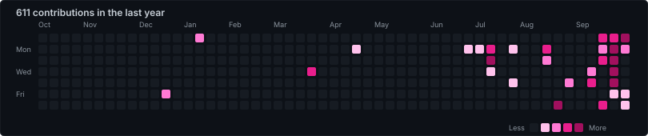

<h1 align="center">Hi, I'm Pushpam Raj Satyarthi 👋</h1>

  

  
  
  
  

---

## ⚡ About Me

CSE undergraduate at **GITAM University, Visakhapatnam** (CGPA **9.17**), focused on **Data Engineering** and **Backend Systems**. I would rather build a pipeline that survives bad input at 3am than tune a model for another half a point of accuracy.

🏢 &nbsp;Software Engineering Intern at **Motherson Technology Services Limited** (AIML Team), where I independently designed and shipped the chat-history persistence layer for **LegalLens**, a live AI legal-research platform — a 316-line FastAPI module, 9 CRUD endpoints, and a hybrid SQLite + Azure Blob Storage architecture, across a full-stack React/TypeScript + Python codebase.

🎓 &nbsp;**IBM Data Engineering Professional Certificate** — 16 courses covering Airflow, Kafka, Spark, Hadoop, data warehousing, NoSQL and BI.

🚩 &nbsp;**Domain Lead, Open Source & DevX** — GitHub Community, GITAM Vizag.

🔭 &nbsp;**Currently working on**
- Airflow DAG orchestration, star-schema design and incremental ETL patterns
- Deepening FastAPI, PostgreSQL and cloud-storage architecture
- V Semester: Data Warehousing & Mining, Computer Networks, Machine Learning Techniques

💬 &nbsp;Ask me about ETL design, schema normalization, or why your pipeline is silently dropping rows.

---

## 💻 Tech Stack

**Languages**

**Data Engineering & Big Data**

**Databases**

**Backend & Frameworks**

**Machine Learning**

**Cloud, Tools & Systems**

---

## 🚀 Featured Projects

<table>
<tr>
<td width="50%" valign="top">

### 🛡️ [Fake Account & Threat Detection Engine](https://github.com/pushpam2404/fake_acc)
`Python` `XGBoost` `SHAP` `FastAPI` `React` `NetworkX`

Intelligence-grade detection engine for **ITBP / Ministry of Home Affairs**, built for Smart India Hackathon.

- Dual platform-specific XGBoost classifiers on **101,000+ labeled accounts** — **90.04%** accuracy on X, **96.87%** on Meta
- Diagnosed a mislabeled 50,000-row dataset silently capping accuracy at 67%; bifurcated feature pipelines lifted it **23 points**
- SHAP explainability surfaced as plain-English risk factors
- Playwright live scraping with zero credential storage, NetworkX coordinated-behaviour graph, one-click forensic PDF exports

</td>
<td width="50%" valign="top">

### 🏦 [Global Banking Data ETL Pipeline](https://github.com/pushpam2404/global-finance-etl)
`Python` `Pandas` `NumPy` `SQL`

Fault-tolerant, multi-source ETL pipeline feeding a unified SQL warehouse.

- **30% less data redundancy** via automated schema normalization and vectorized outlier detection
- Incremental delta loads replacing full batch refreshes, eliminating redundant reprocessing
- Structured logging and alerting that intercepts schema mismatches **before** load — no silent corruption reaches the warehouse
- Strict type validation enforced at the transformation stage

</td>
</tr>
<tr>
<td width="50%" valign="top">

### 🏥 [KAPS MedTech — Healthcare Management](https://github.com/pushpam2404/KAPS-Medtech)
`PostgreSQL` `Node.js` `Raw SQL` `JWT` `BCrypt`

Built in **24 hours** at Gitathon University Hackathon.

- **3NF-compliant** schema modelling many-to-many relationships across patients, doctors and appointment slots
- Real-time smart-inventory module that auto-quarantines expired medication, replacing a manual audit
- PHI secured with BCrypt hashing and stateless JWT auth
- One-command deployment — `init_db.js` cuts environment setup to **under 30 seconds**

</td>
<td width="50%" valign="top">

### ✈️ [TripSync — AI Travel Platform](https://github.com/pushpam2404/Trip-Sync)
`TypeScript` `MongoDB` `React` `Gemini API` `Mapbox`

Smart India Hackathon 2025 qualifier, prototype from zero in **24 hours**.

- Node.js/Express backend supporting multiple concurrent users
- Geospatial pipeline over Mapbox and Google Maps for multi-stop routes with real-time waypoint prediction
- Led a full-stack **TypeScript migration** with strict type enforcement, closing a whole class of runtime errors

</td>
</tr>
</table>

### ⚙️ High-Performance Autocomplete Engine &nbsp;·&nbsp; `C` `Make` `Valgrind` `GDB`

Low-latency autocomplete backend in C — **O(k)** lookup via a Trie regardless of dataset size, Min-Heap priority queue ranking Top-N terms in **O(log N)**, **zero memory leaks** verified under Valgrind, and a binary serialization protocol for sub-second cold starts.

### 🎃 Open Source @ GITAM &nbsp;·&nbsp; [terminal-arcade](https://github.com/pushpam2404/terminal-arcade) &nbsp;·&nbsp; [open-source-launchpad](https://github.com/pushpam2404/open-source-launchpad)

As Domain Lead, I build the repositories our community learns to contribute on — beginner-friendly issues, CI that explains its failures, and automation that assigns issues so nobody sits blocked.

---

## 📊 GitHub Analytics

  
  
  

  

  

<!--
  The classic github-readme-stats cards are intentionally left out for now:
  the shared instance at github-readme-stats.vercel.app is returning 503 and
  renders a "Something went wrong!" card rather than your stats. When it is
  back up, delete this comment and paste the two lines below back in.

  
  
-->

---

## 🏆 GitHub Trophies

  

---

## ✍️ Random Dev Quote

  

---

## 🏅 Achievements

- 🚩 **Domain Lead, Open Source & DevX** — GitHub Community, GITAM Vizag
- 🥇 **Smart India Hackathon 2026** — Internal Round Qualifier, led the Fake Account & Threat Detection Engine (SIH-1775) for ITBP / Ministry of Home Affairs
- 🥈 **Smart India Hackathon 2025** — Internal Round Qualifier, led TripSync from zero in a 24-hour constraint
- 🏗️ **Gitathon University Hackathon** — shipped the full KAPS MedTech backend in 24 hours
- 📜 **IBM Data Engineering Professional Certificate** — 16-course specialisation

---
